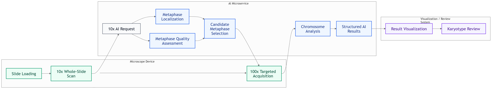

# Automated Karyotyping AI System

  

> Portfolio case study of AI modules developed for an automated chromosome karyotyping analysis platform.  
> This repository does not contain proprietary source code, model weights, patient data, internal datasets, or confidential product documents.

## Overview

This repository presents a portfolio case study of AI modules developed for an automated chromosome karyotyping analysis platform. Traditional karyotyping requires experts to manually select high-quality metaphase cells, segment chromosomes, and arrange them for cytogenetic review. This process is time-consuming and depends heavily on expert experience.

The system was designed to support an automated microscope workflow. A 10x whole-slide scan is first used to locate candidate metaphase regions and assess metaphase quality. Based on the AI results, the device performs targeted 100x image acquisition for detailed chromosome-level analysis.

The AI components perform metaphase localization, quality assessment, chromosome segmentation, chromosome classification, and structured result output for downstream visualization and review.

  

## Key Highlights

| Area | Details |
|---|---|
| Product type | Automated chromosome karyotyping analysis platform |
| Imaging workflow | 10x whole-slide scan → 100x targeted acquisition |
| AI tasks | Metaphase localization, quality assessment, chromosome segmentation, chromosome classification |
| Key challenge | Overlapping chromosomes and strict metaphase-quality requirements |
| Data scale | ~20K annotated samples / instances |
| Deployment | AI microservices integrated with microscope scanning workflow |
| Role | AI team leader |

## AI Modules

### 1. Metaphase Localization

The system analyzes 10x whole-slide images to locate candidate metaphase regions for further high-magnification acquisition.

### 2. Metaphase Quality Assessment

Candidate metaphase regions are evaluated based on quality requirements for karyotyping analysis. This step is important because low-quality metaphase images can affect the reliability of downstream chromosome segmentation and classification.

### 3. Chromosome Analysis

On 100x images, the AI module performs chromosome-level analysis to support downstream karyotype visualization and review. Since chromosomes can be dense, curved, fragmented, and heavily overlapping, a vision-language assisted training strategy was explored to reduce classification errors among visually similar chromosome types by incorporating both image features and textual morphology descriptions.

## Technical Challenges

- **Metaphase quality control:** Karyotyping analysis requires suitable metaphase cells. Quality assessment at 10x magnification is critical because it determines whether the sample is suitable for downstream analysis.
- **Chromosome overlap:** Chromosomes often overlap or touch each other, making instance-level segmentation difficult.
- **Fine-grained classification:** Different chromosome types may have similar morphology and feature, requiring robust feature extraction and classification.

## Deployment

The AI modules were deployed as microservices and integrated with the microscope device workflow through APIs. The device-side system could request AI results during scanning, including candidate metaphase localization, quality assessment, and chromosome-level analysis results.

## My Involvement

I led the AI work for the automated karyotyping analysis platform, covering requirement analysis, AI workflow design, data collection and management, algorithm development, and integration with the device-side scanning system.

Main areas I worked on:

- worked with clinical/product stakeholders to translate karyotyping workflow requirements into AI system functions;
- designed the AI-assisted scanning workflow from 10x whole-slide screening to 100x targeted acquisition;
- planned and managed data collection and annotation for karyotyping-related AI tasks;
- led algorithm development for chromosome localization, segmentation, classification, and quality assessment;
- deployed AI modules as microservices and integrated them with the microscope scanning workflow;